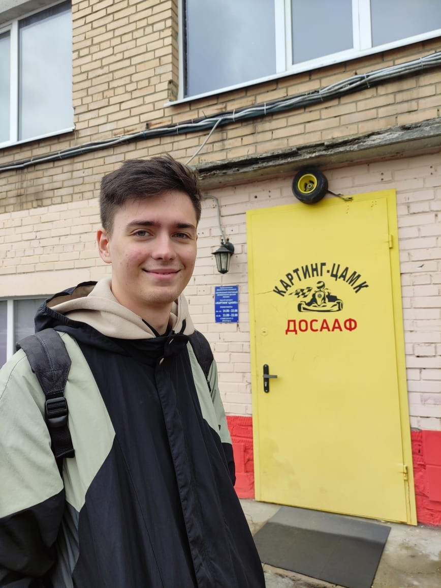
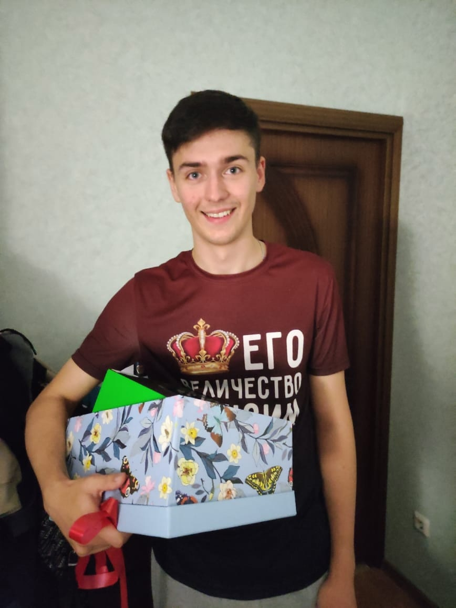
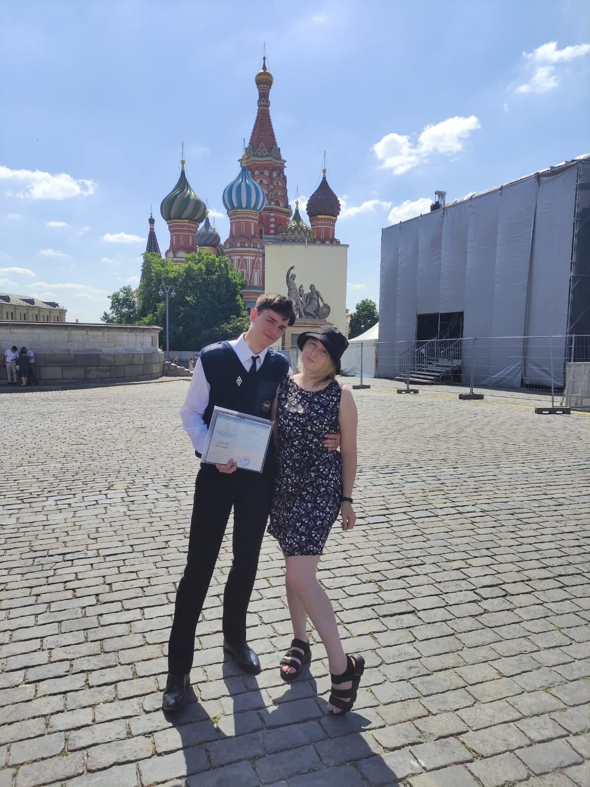
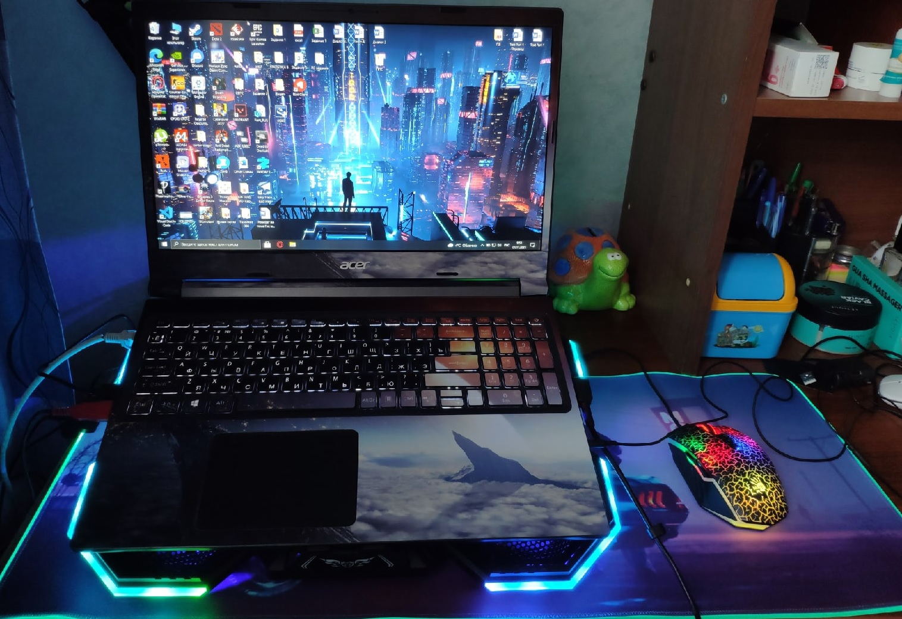
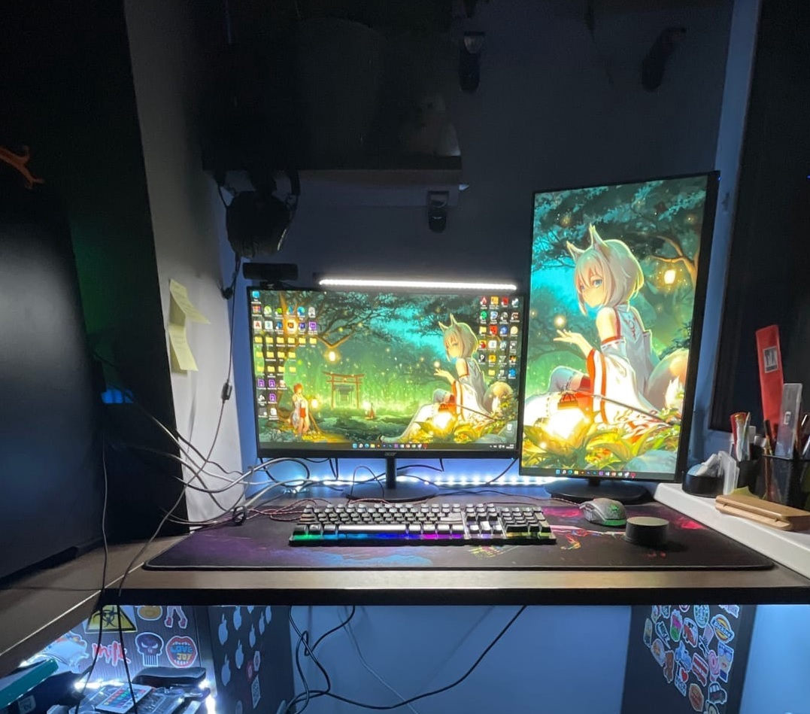

# Мой сайт

> Меня зовут Максим. 

> Родился и живу в Зеленограде. Мне 22 года. 

> Закончил 11 классов на инженерном направлении, закончил институт Академия МЧС России по направлению информатика и вычислительная техника, поступил в магистратуру в МГПУ по направлению Архитектор цифрового пространства.

После выпуска из института понял, что мне нравится работать с языком Python и создавать сайты на языке HTML и CSS. 

Записался на курс Fullstack разработчик на [Нетологии](https://netology.ru), чтобы заниматься тем, что нравится.

Как хобби занимаюсь ремонтом и апгрейдом компьютеров и ноутбуков.

# мое рабочее место

# рабочее место которое я создал другу